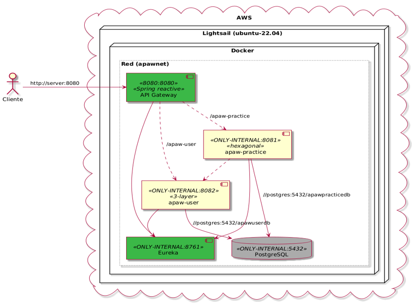
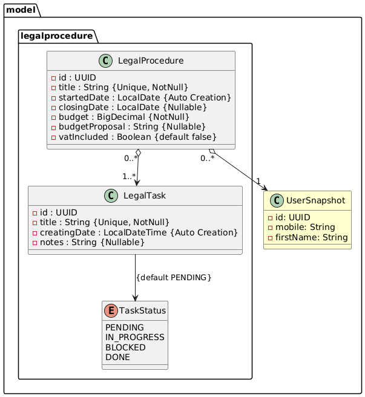

# [Máster en Ingeniería Web por la Universidad Politécnica de Madrid (miw-upm)](http://miw.etsisi.upm.es)

## Arquitectura y Patrones para Aplicaciones Web

> Este repositorio es el de gestión de la práctica.

### Estado del código

### Tecnologías necesarias

`Java` `Maven` `GitHub` `GitHub Actions CI` `Sonarcloud` `Slack` `Spring-boot` `OpenAPI` `Docker` `AWS`

### :gear: Instalación del proyecto

1. Clonar los repositorios en tu equipo, **mediante consola**:

```sh
> cd <folder path>
> git clone https://github.com/miw-upm/apaw-*
```

2. Importar el proyecto mediante **IntelliJ IDEA**
    1. **Open Project**, y seleccionar la carpeta del proyecto.

## :page_with_curl: Enunciado de la práctica

> La práctica consiste en ampliar de forma colaborativa una aplicación basada en microservicios, pero solo se manejará
> el Back-End, sin Front-end.  
> NOTA. Todo el software deberá estar en ingles.

El ecosistema está montado con Docker, con 4 microservicios: `apaw-gateway`, `apaw-eureka`, `apaw-practice` y
`apaw-user`, mas un pryecto de test: `apaw-test`.

- **`apaw-practice`** — arquitectura hexagonal. Es donde desarrollas tu tema.
- **`apaw-user`** — arquitectura en tres capas. Gestiona usuarios. Lo amplías tú cuando lo necesites.
- **`apaw-gateway`** (Spring reactive, único puerto expuesto) y **`apaw-eureka`**.
- **PostgreSQL**: un motor compartido, una base de datos por API (`apawpracticedb`, `apawuserdb`).
- Todo sobre **Docker** en una instancia Lightsail de AWS.
- **`apaw-test`** — proyecto para Tests Funcionales globales

Trabajo **individual** sobre **repositorios compartidos** por toda la clase.

Los issues del proyecto de gestión estarán centralizados en: https://github.com/miw-upm/apaw.
Por eso, los mensajes de los commits deben tener la coletilla: `miw-upm/apaw#666`, con el número de issue adecuado.
La url del proyecto de gestión es: https://github.com/users/miw-upm/projects/24.

Se presenta un diagrama de despliegue:


### 1. Clonar los cinco proyectos

* https://github.com/miw-upm/apaw-eureka
* https://github.com/miw-upm/apaw-gateway
* https://github.com/miw-upm/apaw-user
* https://github.com/miw-upm/apaw-practice
* https://github.com/miw-upm/apaw-test

Deberán crearse los docker necesarios para hacerlo funcionar localmente.

### 2. Epic

Cada alumno deberá crear un `Epic` con el título de la ampliación, y contendrá una serie de sub-issues (Feature, Story,
Chore o Bugfix) para alcanzar los objetivos.

Por ejemplo: `Invoicing`, `Appoiments`, `Expenses`... no puede haber repetidos. Los nombres de los paquetes, deben
coincidir exactamante con la historia, ejemplo, `invoicing`, `appoiments`. Dentro de cada paquete no puede haber clases
con nombre repetidos entre todas las prácticas.
Así antes de elegir un nombre, revisar que no ha sido utilizado. Se buscan nombre coherentes, no vale poner sufijos para
evitar colisiones.

> A modo de ejemplo, existe un `Epic`, llamado `LegalProcedure`, que se ha desarrollado completamente.

### 3. Modelo

Dos entidades relacionadas entre sí, ambas dentro de tu tema, y referencia a usuario (se puede utilizar cualquier
multiplicidad).
Nos debemos apoyar en la IA para elegir adecuadamente o que nos de ideas, pero luego se debe defender.

Reglas:

- **Mínimo 5 atributos** por entidad. Los eliges tú.
- **Tipos de atributos variados**: LocalDate, String, Boolean, Integer o BigDecimal...
- **Limitación de atributos variados**: únicos, autocreados, opcionales, por defecto...
- **Relación unidireccional.** Prohibidas las relaciones cíclicas.
- **Relación entre los modelos: 1-n, n-1 o n-n.** Prohibida la 1-1.
- **La dirección la eliges y la justificas** según qué concepto depende de cuál.
- **`UserSnapshot`**, al menos un modelo relacionado con `UserSnapshot`, con cualquier multiplicidad.
- **`UserSnapshot`** compartido entre todos. Si se necesita ampliar, se puede.

Una vez aceptado por el profesor, se debe subir a `apaw/docs` la imagen UML del modelo con formato `png`.

#### Paquetes

```
model.<tutema>          entidades, enumerados, DTOs de entrada y salida
model                   UserSnapshot (común a toda la clase)
```

#### Modelo de referencia, resuelto y no elegible



### :clap: Entraga parcial del modelo en UML
> Debe estar cerrado y con el visto bueno del profesor hasta las siguientes fechas:
* **Entrega Progresiva**: Hasta el **sabado 3 de octubre de 2026**.
* **Entrega Global**: Hasta el **viernes 18 de diciembre de 2026**.
* **Entrega Extraordinaria**: **Hasta el viernes 28 de mayo de 2027**.

### 4. Modelo en Java en `apaw-practice`
Una vez aceptado por el profesor, se debe subir a `apaw/docs` la imagen UML del modelo con formato `png` y debe estar
en la descripción del issue creado para tal fin.

Con un nuevo Feature, programar el modelo en Java en `apaw-practice`.

### 5. Persistencia (nuevo Feature)

La navegabilidad entre entidades JPA **la decides tú**, y no tiene por qué coincidir con la del dominio. En el modelo
manda la dependencia conceptual; en persistencia mandan los accesos.

- `fetch = LAZY` explícito, aunque sea el valor por defecto.
- En GET /{id} cargas un procedimiento, el mapper toca la colección, JPA lanza una consulta más. Total: 2 consultas.
  Aceptable.
- En el findCriteria que devuelve 50 procedimientos, cargas los 50 con una consulta, y el mapper toca la colección de
  cada uno: 50 consultas más. Total: 51. **A evitar**.

### 6. CRUD completo de la entidad secundaria (nuevo Feature)

- POST — crea. `ConflictException` si ya existe otra con el mismo valor en el/los atributo único.
- GET /{id} — devuelve una. `NotFound`  si no existe.
- PUT /{id} — sustituye el recurso completo, de los atributos actualizables. `NotFound` si no existe,
  `ConflictException` si el cambio rompe la unicidad.
- DELETE /{id} — elimina. `ConflictException` si la entidad está siendo usada por alguna entidad principal: no se borra
  algo que está referenciado.
- GET — lista todas, con orden determinista.
- PATCH — modificación parcial. Solo se actualizan los campos presentes en la petición; los ausentes quedan intactos.
  Libre el tipo de patch

### 7. Creación de la entidad principal (nuevo Feature)

La creación de la entidad principal recibe un DTO propio (CreationLegalProcedure en el ejemplo), distinto de la entidad
de dominio:

- No lleva atributos calculados ni asignados por el sistema, como fechas de creación.
- No lleva el UserSnapshot, sino el identificador de usuario. El caso de uso lo resuelve contra apaw-user y valida que
  exista.
- No lleva objetos de la entidad secundaria, sino sus identificadores. Las entidades secundarias ya existen; la creación
  las asocia, no las crea.
- La lista de identificadores no puede venir vacía si la cardinalidad de tu modelo exige al menos uno.

### 8. FindCriteria (nuevo Feature)

Un DTO de criterios para búsquedas, con almenos **cuatro campos, todos opcionales y nullsafe**: el que llega a `null` no filtra.

Los cuatro deben cubrir estos tipos:

- Un atributo de la entidad principal.
- Un criterio derivado, no un campo directo (el `opened` del ejemplo se calcula sobre `closingDate`).
- Un atributo de la **entidad relacionada**, que obliga a atravesar la relación.
- Un atributo de **usuario**, que vive en `apaw-user`. Una sola llamada a `apaw-user`.

### 9. Report (nuevo Feature)

Una **proyección de lectura**, nunca entidades de dominio. Debe cumplir a la vez:

- Combina las dos entidades.
- Agrupa y agrega.
- Ordena por el valor agregado.
- Si lleva `UserSnapshot`, se hidrata en una sola llamada a `apaw-user`.

### :clap: Entraga de la práctica

Indicar como texto en la subida:

* Nombre de la Epic:
* Cuenta de GitHub:
* Nombre aparecen en los commits:

> **NOTA. Acordarse de dar al botón de envío.**