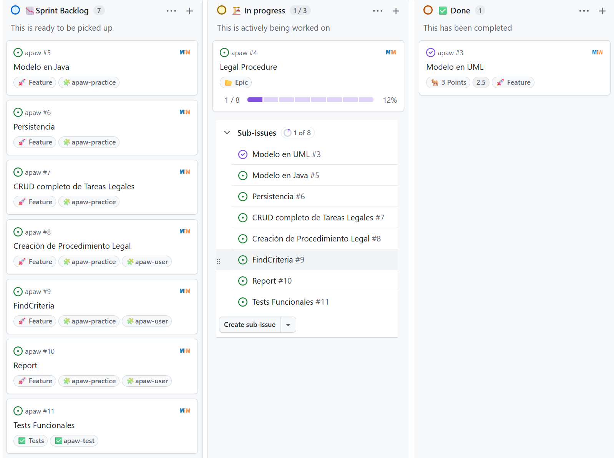

# [Máster en Ingeniería Web por la Universidad Politécnica de Madrid (miw-upm)](http://miw.etsisi.upm.es)

## Arquitectura y Patrones para Aplicaciones Web

> Este repositorio es el de gestión de la práctica.

### Estado del código

| Microservicio     | CI                                                                                                                                                      | Calidad                                                                                                                                                                                                     | Despliegue                                                                                                                       |
|-------------------|---------------------------------------------------------------------------------------------------------------------------------------------------------|-------------------------------------------------------------------------------------------------------------------------------------------------------------------------------------------------------------|----------------------------------------------------------------------------------------------------------------------------------|
| **APAW User**     |          |          |          |
| **APAW Practice** |  |  |  |
|                   | **GitHub Actions**                                                                                                                                      | **SonarCloud**                                                                                                                                                                                              | **AWS Lightsail - staging**                                                                                                      |

### Tecnologías necesarias

`Java` `Maven` `GitHub` `GitHub Actions` `SonarCloud` `Slack` `Spring-Boot` `Spring-Cloud` `GitHub Packages` `OpenAPI`
`JPA` `PostgreSQL` `Docker` `Eureka` `Gateway` `AWS Lightsail`

### :gear: Proyectos

- [🧩 APAW user](https://github.com/miw-upm/apaw-user)
- [🧩 APAW practice](https://github.com/miw-upm/apaw-practice)

- [⚙️ APAW Eureka](https://github.com/miw-upm/apaw-eureka)
- [⚙️ APAW Gateway](https://github.com/miw-upm/apaw-gateway)

- [✅ APAW Test](https://github.com/miw-upm/apaw-test)

## :page_with_curl: Enunciado de la práctica

> La práctica consiste en ampliar de forma colaborativa una aplicación basada en microservicios, pero solo se manejará
> el Back-End, sin Front-end.  
> NOTA. Todo el software deberá estar en inglés, pero la documentación complementaria puede estar en español.

El ecosistema está montado con Docker, con 4 microservicios: `apaw-gateway`, `apaw-eureka`, `apaw-practice` y
`apaw-user`, un motor de BD de postgres en Docker, más un proyecto de test: `apaw-test`.

- **`apaw-practice`**. Arquitectura hexagonal. Microservicio principal de desarrollo.
- **`apaw-user`**. Arquitectura en 3-capas. Gestiona usuarios. Ampliaciones puntuales.
- **`apaw-gateway`**. Con Spring reactive, único puerto expuesto.
- **`apaw-eureka`**. Gestiona el registro de todos los microservicios.
- **`PostgreSQL`**. Motor de BD compartido, pero una base de datos por API: `apawpracticedb` y `apawuserdb`.
- **`AWS Lightsail`**. Instancia de despliegue en la nube con `Docker`.
- **`apaw-test`**. Proyecto para Tests Funcionales globales.

Trabajo **individual** sobre **repositorios compartidos** por toda la clase.

### Gestión del proyecto

> La gestión se realizará mediante Scrum.

- **Gestión de issues**: https://github.com/miw-upm/apaw. Por eso, los mensajes de los commits deben tener la coletilla:
  `miw-upm/apaw#666`, con el número de issue adecuado.
- **Gestión del proyecto**: https://github.com/users/miw-upm/projects/24.

### Diagrama de despliegue

### Pasos a seguir

#### 1. Clonar los cinco proyectos

* https://github.com/miw-upm/apaw-eureka
* https://github.com/miw-upm/apaw-gateway
* https://github.com/miw-upm/apaw-user
* https://github.com/miw-upm/apaw-practice
* https://github.com/miw-upm/apaw-test

Deberán crearse los docker necesarios para hacerlo funcionar localmente, no olvideis el docker de BD

#### 2. Epic

Cada alumno deberá crear un `Epic` con el título de la ampliación, y contendrá una serie de sub-issues (Feature, Story,
Chore o Bugfix) para alcanzar los objetivos.

Por ejemplo: `Invoicing`, `Appointments`, `Expenses`... no puede haber repetidos. Los nombres de los paquetes deben
coincidir exactamente con la historia, ejemplo, `invoicing`, `appointments`. Dentro de cada paquete no puede haber clases
con nombre repetidos entre todas las prácticas.
Así antes de elegir un nombre, revisar que no ha sido utilizado. Se buscan nombre coherentes, no vale poner sufijos para
evitar colisiones.

> A modo de ejemplo, existe un `Epic`, llamado `LegalProcedure`, que se ha desarrollado completamente.

#### 3. Modelo

Dos entidades relacionadas entre sí, ambas dentro de tu tema, y referencia a usuario (se puede utilizar cualquier
multiplicidad).
Nos debemos apoyar en la IA para elegir adecuadamente o que nos de ideas, pero luego se debe defender.

Reglas:

- **Mínimo 5 atributos** por entidad. Los eliges tú.
- **Tipos de atributos variados**: LocalDate, String, Boolean, Integer o BigDecimal...
- **Limitación de atributos variados**: únicos, autocreados, opcionales, por defecto...
- **Relación unidireccional.** Prohibidas las relaciones cíclicas.
- **Relación entre los modelos: 1-n, n-1 o n-n.** Prohibida la 1-1.
- **Relación de _AGREGACION_**, ya que la de composición no se realiza el CRUD de la entidad secundaria.
- **La dirección la eliges y la justificas** según qué concepto depende de cuál.
- **`UserSnapshot`**, al menos un modelo relacionado con `UserSnapshot`, con cualquier multiplicidad.
- **`UserSnapshot`** compartido entre todos. Si se necesita ampliar, se puede.

Una vez aceptado por el profesor, se debe subir a `apaw/docs` la imagen UML del modelo con formato `png`.

##### Modelo de referencia, resuelto y no elegible

##### :clap: Entrega parcial del modelo en UML

> Debe estar cerrado y con el visto bueno del profesor hasta las siguientes fechas:

* **Entrega Progresiva**: Hasta el **sábado 3 de octubre de 2026**.
* **Entrega Global**: Hasta el **viernes 18 de diciembre de 2026**.
* **Entrega Extraordinaria**: Hasta el **viernes 28 de mayo de 2027**.

##### :card_index_dividers: Preparación del proyecto de gestión, referencia de Procedimiento Legal

#### 4. Modelo en Java en `apaw-practice`

Una vez aceptado por el profesor, se debe subir a `apaw/docs` la imagen UML del modelo con formato `png` y debe estar
en la descripción del issue creado para tal fin.

Con un nuevo _Feature_, programar el modelo en Java en `apaw-practice`.

**!!!NO hacer tests**

1. RECORDAR!!! añadir siempre la coletilla `miw-upm/apaw#5` en todos los `commits`.
2. RECORDAR!!! siempre, justo antes de fusionar con `develop`, lanzar todos los tests.
3. SIEMPRE!!! para fusionar el _issue_ con _develop_ **Not Fast Forward**: `--no-ff`.   
   `git merge --no-ff -m"merge miw-upm/apaw#5 into develop" feature/5`
4. Subir develop con rapidez y esperar a que `GitHub Actions` termine y sea OK.   
   `git push origin develop`
5. POR ÚLTIMO!!! anotar el tiempo consumido y cerrar el issue

!!!NO subir las ramas de issues al repositorio. Solo si necesitamos compartir el issue con alguien.

#### 5. Persistencia (nuevo _Feature_)

La navegabilidad entre entidades JPA **la decides tú**, y no tiene por qué coincidir con la del dominio. En el modelo
manda la dependencia conceptual; en persistencia mandan los accesos. Si no hay una razón concreta, mantendremos la
relación del modelo.

En este issue, solo nos interesan las clases e interfaces, sin métodos para entender la arquitectura hexagonal, ya que
estos surgiran bajo demanda por hacer los end-points.

**!!!NO hacer tests**

1. Se crean los puertos: `*Gateway`, `*Finder` o `*Writer`.
2. Se añade `*Entity`.
3. Se añade `*Repository`.
4. Se añade `*Adapter`.

- `fetch = LAZY` explícito, aunque sea el valor por defecto.
- En GET /{id} cargas un procedimiento, el mapper toca la colección, JPA lanza una consulta más. Total: 2 consultas.
  Aceptable.
- En el findCriteria que devuelve 50 procedimientos, cargas los 50 con una consulta, y el mapper toca la colección de
  cada uno: 50 consultas más. Total: 51. **A evitar**.

#### 6. CRUD completo de la entidad secundaria (nuevo _Feature_)

Se va notando que la IA cada vez nos da una respuesta certera a la primera, solo necesita entender nuestra arquitectura.

Para mejoras más grandes, plantearse hacer aportaciones parciales a `develop`.

- POST — crea. `ConflictException` si ya existe otra con el mismo valor en atributo único.
- GET /{id} — devuelve una. `NotFound`  si no existe.
- PUT /{id} — sustituye el recurso completo, de los atributos actualizables. `NotFound` si no existe,
  `ConflictException` si el cambio rompe la unicidad.
- DELETE /{id} — elimina. `ConflictException` si la entidad está siendo usada por alguna entidad principal: no se borra
  algo que está referenciado.
- GET — lista todas, con orden determinista.
- PATCH — modificación parcial. Solo se actualizan los campos presentes en la petición; los ausentes quedan intactos.
  Libre el tipo de patch.

> Una vez que se ha programado todo y hemos llegado a un reparto adecuado de las responsabilidades, se van a añadir
> una población en el seeder básica. Se debe seguir la filosofia del seeder. Después, se realizan los tests indicando
> que se apoye en el seeder para su simplicidad. Contar que los tests deben tener en cuenta que el seeder puede crecer,
> pero no se puede cambiar el contenido existente.

#### 7. Creación de la entidad principal (nuevo _Feature_)

La creación de la entidad principal recibe un DTO propio (CreationLegalProcedure en el ejemplo), distinto de la entidad
de dominio:

- No lleva atributos calculados ni asignados por el sistema, como fechas de creación.
- No lleva el UserSnapshot, sino el identificador de usuario. El caso de uso lo resuelve contra apaw-user y valida que
  exista.
- No lleva objetos de la entidad secundaria, sino sus identificadores. Las entidades secundarias ya existen; la creación
  las asocia, no las crea.
- La lista de identificadores no puede venir vacía si la cardinalidad de tu modelo exige al menos uno.

Aquí la IA no acierta demasiado, pero a lo mejor, ya teniendo un ejemplo, podría ir mejor.

> Finalmente añadir tests. Recordar que en este caso solo hay *IT, y se debe mockear el UserFinder. No se puede hacer
> *FT

#### 8. Report (nuevo _Feature_)

Una **proyección de lectura**, nunca entidades de dominio. Debe cumplir a la vez:

- Combina las dos entidades.
- Agrupa y agrega.
- Ordena por el valor agregado.
- Si lleva `UserSnapshot`, se hidrata en una sola llamada a `apaw-user`.

> Finalmente añadir tests

#### 9. FindCriteria (nuevo _Feature_)

Un DTO de criterios para búsquedas, con al menos **cuatro campos, todos opcionales y nullsafe**: el que llega a `null` no
filtra.

Los cuatro deben cubrir estos tipos:

- Un atributo de la entidad principal.
- Un criterio derivado, no un campo directo (el `opened` del ejemplo se calcula sobre `closingDate`).
- Un atributo de la **entidad relacionada**, que obliga a atravesar la relación.
- Un atributo de **usuario**, que vive en `apaw-user`. Una sola llamada a `apaw-user`.

OJO!!! aquí la IA te la lía un poco. Si se debe cambiar `apaw-user` se utilizará el mismo nº de feature.   
CUIDADO!!! la IA se me puso a tocar el `apaw-user` por detras y sin avisarme, aunque el proyecto era sobre
`apaw-practice`.

> Finalmente añadir tests (*IT) con mocks si atacan a apaw-user

#### 10. Tests Funcionales (nuevo _Feature_)

Añadir Tests Funcionales a `apaw-test` de todas las mejoras realizadas. Recordar apoyarse en el seeder para simplificar
los tests.

### :clap: Entrega de la práctica

Indicar como texto en la subida:

* Nombre de la Epic:
* Cuenta de GitHub:
* Nombre aparecen en los commits:

> **NOTA. Acordarse de dar al botón de envío.**